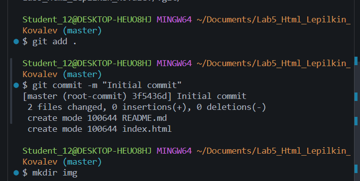

# Лабораторная работа №5. Введение в HTML
**ФИО**: Лепилкин М.А
**Группа**: ИСП-232
**Дата**: 27.01.2026

# Описание работы
В данной лабораторной работе создаётся проект для изучения основ HTML.
Вы настраиваете рабочую директорию, создаёте базовые файлы, подключаете Git и GitHub, а также
подготавливаете HTML-файл для последующего изучения структуры веб-страницы.

# Структура проекта
- **index.html** — основной HTML-файл
- [README.md](/README.md) — описание лабораторной работы
- **img/** — скриншоты
- **html/** — задания
- **Базовые HTML-теги** — описание тегов HTML
- **Примеры из практики**

---
# Теги в HTML
Структура парного тега:
```HTML
<h1>"Это заголовок</h1>
```
# Базовые HTML-теги
**Примеры:**
```HTML
<h2>Заголовок</h2>
<p>Абзац текста</p>
<strong>Жирный</strong>
<em>Курсив</em>
<hr>
<a href="https://example.com">Ссылка</a>


```
# Пример из практики

```HTML
<h2>**Базовое HTML-Теги**</h2>
    <p>
      HTML позволяет <strong>выделять</strong> текст и делать <em>акценты</em>
    </p>
    <hr />
    <p><a href="https://github.com">Мой GitHub</a></p>
    <p></p>
```