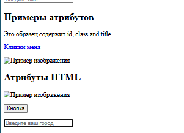

# Лабораторная работа №5. Введение в HTML
**ФИО**: Лепилкин М.А
**Группа**: ИСП-232
**Дата**: 27.01.2026

# Описание работы
В данной лабораторной работе создаётся проект для изучения основ HTML.
Вы настраиваете рабочую директорию, создаёте базовые файлы, подключаете Git и GitHub, а также
подготавливаете HTML-файл для последующего изучения структуры веб-страницы.

# Структура проекта
- **index.html** — основной HTML-файл
- [README.md](/README.md) — описание лабораторной работы
- **img/** — скриншоты
- **html/** — задания
- **Базовые HTML-теги** — описание тегов HTML
- **Примеры из практики**

---
# Теги в HTML
Структура парного тега:
```HTML
<h1>"Это заголовок</h1>
```
# Базовые HTML-теги
**Примеры:**
```HTML
<h2>Заголовок</h2>
<p>Абзац текста</p>
<strong>Жирный</strong>
<em>Курсив</em>
<hr>
<a href="https://example.com">Ссылка</a>


```
# Пример из практики

## Базовое HTML-Теги
```HTML
<h2>Базовое HTML-Теги</h2>
    <p>
      HTML позволяет <strong>выделять</strong> текст и делать <em>акценты</em>
    </p>
    <hr />
    <p><a href="https://github.com">Мой GitHub</a></p>
    <p></p>
```

---
## Списки
```HTML
 <p>Списки:</p>
    <ol>
      <li>Первый пункт</li>
      <li>Второй пункт</li>
      <li>Третий пункт</li>
    </ol>

    <ul>
      <li>Элементы списках</li>
      <li>Еще один элемент</li>
    </ul>

    <ul>
      <li>
        <ol>
          <li>Вложенный 1</li>
          <li>Вложенный 2</li>
        </ol>
      </li>
    </ul>
```

---
## Примеры атрибутов
<h2>Примеры атрибутов</h2>
    <p id="main-text" class="highlight" title="Это всплывающая подсказка"">Это образец содержит id, class and title</p>
    <p><a href="https://example.com" target="_blank" title="Откроется в новой вкладке">Кликни меня </a></p>
    <p>Галерея</h2>
    <p></p>
    <p></p>
    <p></p>
```

## Таблица 
```HTML
<table border="1">
        <tr>
            <th>Имя</th>
            <th>Возраст</th>
        </tr>
        <tr>
          <td>Max</td>
          <td>18</td>
        </tr>
        <tr>
          <td>Timon</td>
          <td>19</td>
        </tr>
    </table>
```

---
## Пример HTML-формы
```HTML
<h2>Пример HTML-формы</h2>
    <form>
        <label for="username">Имя:</label>
        <input id="username" type="text" placeholder="Введите имя">
        <br><br>
        <label for="email">Email:</label>
        <input id="email" type="email" placeholder=" example@mail.com ">
        <br><br>
        <label for="city">Город:</label>
        <select id="city">
          <option>Волгоград</option>
          <option>Волжский</option>
          <option>Камышин</option>
        </select>
        <br><br>
        <label for="message">Сообщение:</label>
        <textarea id="message" rows="4" placeholder="Напишите текст…"></textarea>
        <br><br>
        <button type="submit">Отправить</button>
    </form>
  </body>
  ```